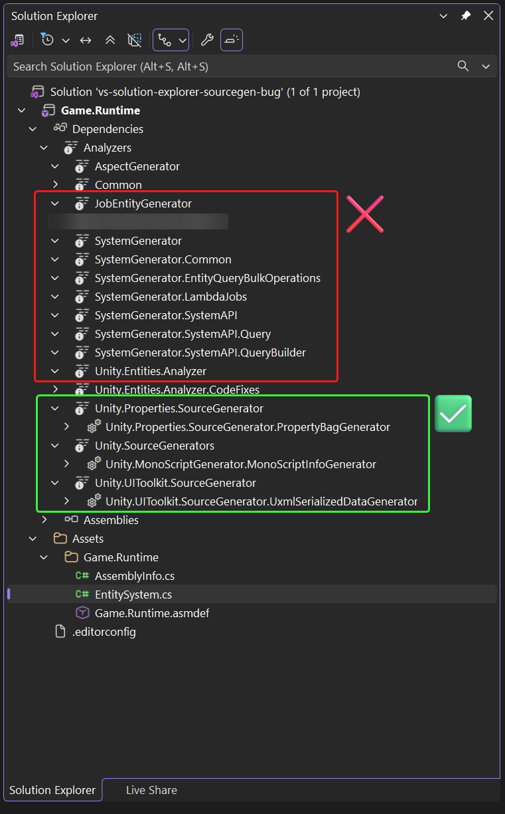
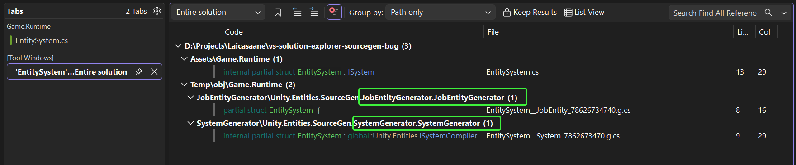
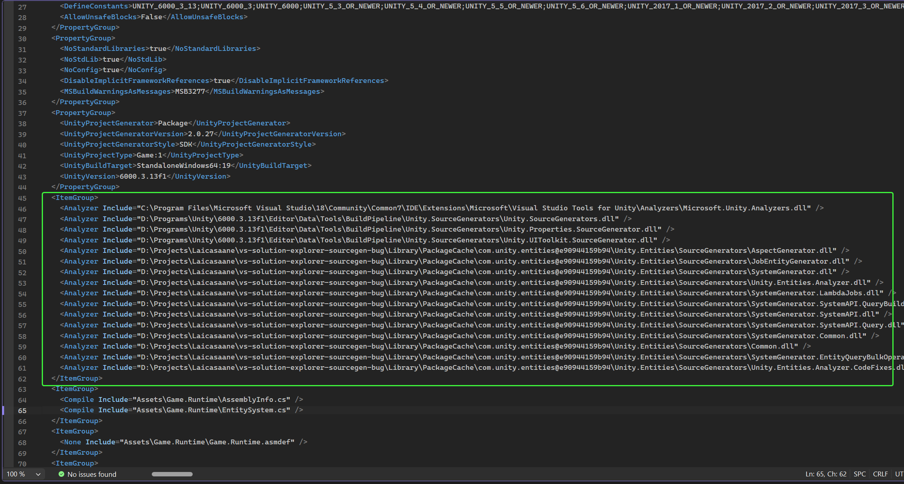
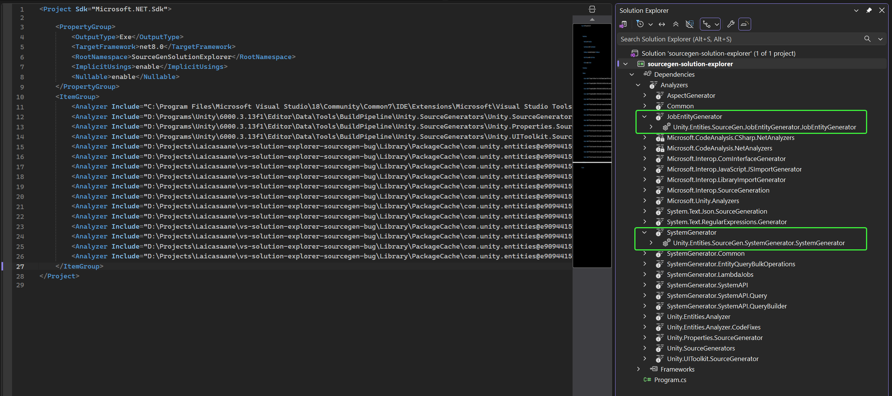

# Visual Studio Solution Explorer SourceGen Bug

Solution Explorer does not list source generators from dlls reside in PackageCache.

## Environment

- Unity 6000.3.13f1
- Visual Studio 2026 (18.5.2)

## Description

In the screenshot below, there are two groups of source generator dlls:
1. Green group: The dlls come from Unity installation directory.
2. Red group: The dlls come from the project's `Library/PackageCache` directory.

The generators in the Green group are listed in the Solution Explorer when we expand the reference dlls, while the ones in the Red group are not listed.

## Steps to Reproduce

1. Have an instance of Unity 6000.3.13f1 installed.
2. Clone this repository and open the project in Unity.
3. Open the generated Visual Studio solution.
4. Navigate to the Solution Explorer and expand "Analyzers" category under "Dependencies".
5. Expand each reference dll and observe whether the source generators are listed.
6. Navigate to the `Assets/Game.Runtime/EntitySystem.cs` file.
7. Right-click on the `EntitySystem` struct, then use "Go to Definition" context menu.
8. Observe the result panel.
    - The generators from the Red group do work as expected, even though they are not listed in the Solution Explorer.

9. On the same machine, create a blank C# .NET project (can be .NET 6/8/10)
10. Navigate to the root folder of the cloned Unity project
11. Open the "Game.Runtime.csproj" in a text editor
12. Copy the `<ItemGroup>` block which contains multiple `<Analyzer Include="[dll path]" />`

13. Paste the copied `<ItemGroup>` block into the .csproj file of the previously created C# .NET project.
14. Open that C# .NET project in Visual Studio.
15. Navigate to the Solution Explorer and expand "Analyzers" category under "Dependencies".
16. Expand each reference dll and observe whether the source generators are listed.
    - In this case, all the source generators are listed in the Solution Explorer, regardless of whether they come from the Unity installation directory or the PackageCache directory.

